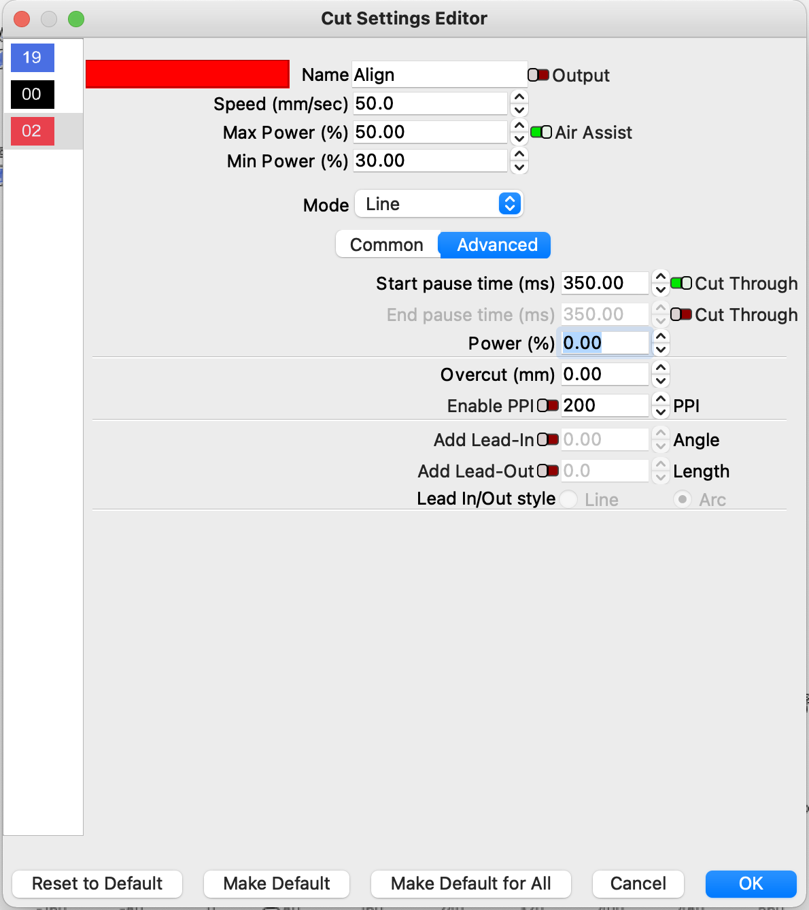

# PenServo

A small arduino sketch to operate a servo from the Air/Spindle pin from standard GRBL. 

It includes a very small serial console to set the up/down position of the servo and saves those values to EEPROM. 

If you connect to the sketch whilst running, you can issue commands like 
```
u=20
d=150
?
```
To set the extents and query current status.

## Lightburn Settings

Once the hardware is set up, you will need to tweak Lightburn. 
Because it takes time to raise/lower the servo, you  will need to add a delay after the air/spindle is switched on. 



This happens in the advanced tab; setting the start and end times will allow the servo to move, before the machine starts moving. I found somewhere between 250 and 500 ms were about right, but it'll depend on the speed of your servo and the distance it needs to move. 

## Hardware
I set my machine up as a GRBL-M3 machine. This results in Lightburn generating M3 (Spindle Start) and M5 (Spindle Stop) GCode instructions at the correct places: 

```
; LightBurn 1.1.03
; GRBL-M3 (1.1e or earlier) device profile, current position
; Bounds: X-142 Y0 to X0 Y1
G00 G17 G40 G21 G54
G91
; Cut @ 50 mm/sec, 50% power
M8
M5
G0 X0Y1
; Layer Border
M3
G1 X-23.417Y-0.165S127.5F3000
M5
G0 X-0.5
M3
G1 X-46.833Y-0.333
M5
G0 X-0.5
M3
G1 X-46.833Y-0.334
M5
G0 X-0.5
M3
G1 X-23.417Y-0.168
M5
M9
G1 S0
; return to starting pos
G0 X142Y0
M2
```

With this, I was able to connect the two grounds of the arduinos, then connect pin 13 (`INPUT_PIN`) to the spindle pin of the arduino running GRBL. 

It was very useful when testing this out to initially connect an LED to the spindle pin, so that I could see what was happening. 

Alternatively, if you have a board like the MKS-DLC32, it looks like the TTL-Output pin may be the right choice, although you'll want to ensure there's a laser output level that holds the pin fully on, not outputting a PWM signal, which would cause the Servo Controller to constantly try to shift up and down! 

It looks like in that situation, setting the `$30` [parameter](https://github.com/makerbase-mks/MKS-DLC32/wiki/Firmware#parameters-configuration) in GRBL to a value that Lightburn can send will set the PWM output to 100%. e.g. if $30 is 1000, then ou want GRBL sending `M3 S1000` to turn the pin fully on. 

The other sneaky (but unverified) way to do it would be to tell Lightburn that your machine has a Z axis. That will cause Lightburn to send `G01 Z[some number]` commands on the start of each "cut" - you could likely disconnect the Z stepper driver and use the direction pin for the Z axis as a signal. That approach would need verifying, as I don't know whether the pin is left on/off after a move has happened. 